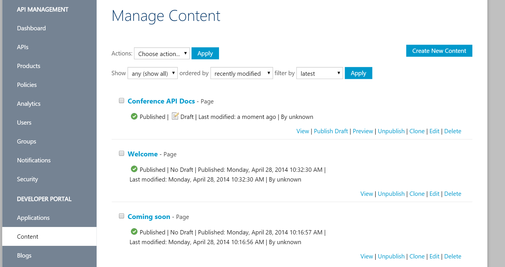
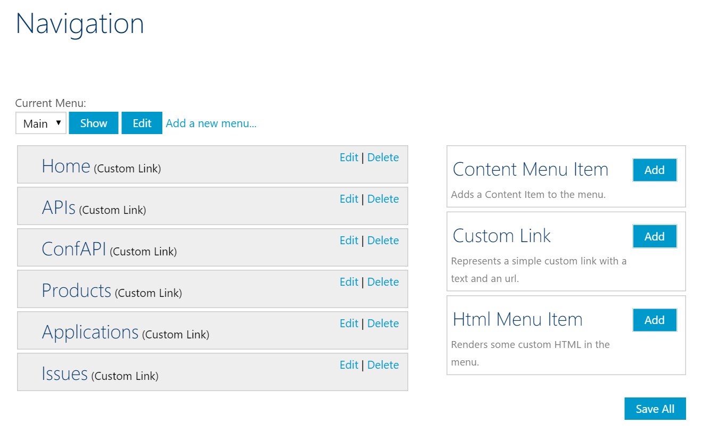
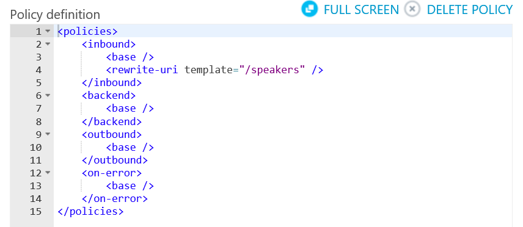
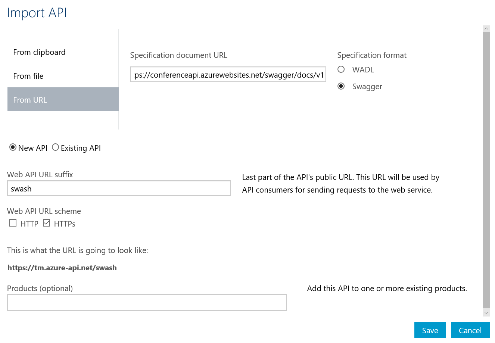
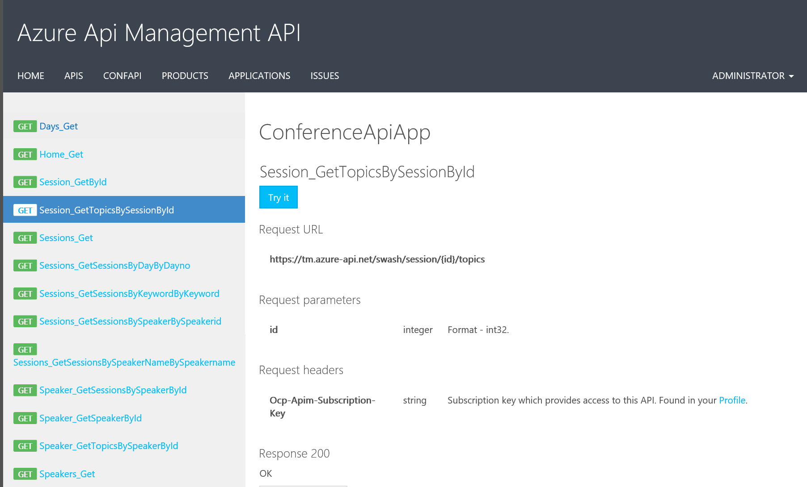
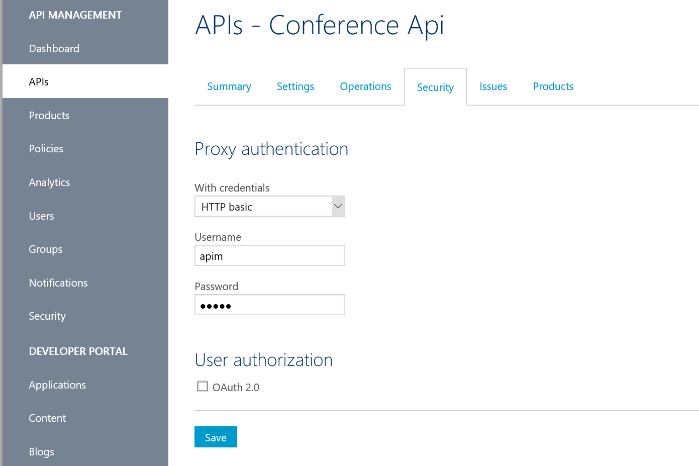
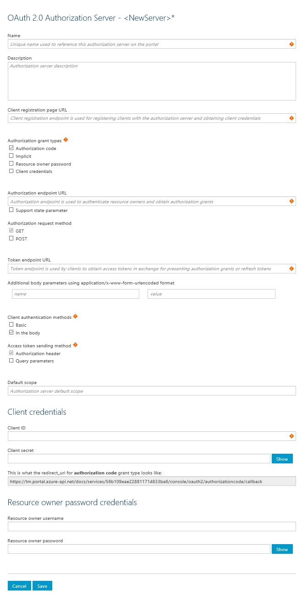

  API Docs and Console

  

  Houston, we have a problem. That’s not exactly useful documentation for the API.

  You can do it all yourself, by creating custom Content pages,

  

  And hooking them up to the menu.

  

  

  But we would rather not re-implement the docs pages with the Try functionality.

  So back to the admin portal

  

  We can add operations manually

  

  

  Let’s take a short detour over to policies,

  

  The defined operations are now showing up as a policy scope.

  

  The configured Rewrite rule is simply a policy.

  Back to the Speakers Operation configuration and let us define some known responses.

  

  Returning to the developer console we can see the documentation for our Speakers operation.

  

  For a large API, creating all the operation descriptions could take a while. Another option is to import the operations based on an API Description language.

  .Net APIs can generate an API Description language document using a library called Swash buckle.

  

  Review imported operations,

  

  And parameters,

  

  And responses,

  

  Response types are defined based on formatters available.

  Swashbuckle doesn’t support representation examples out of the box unfortunately. So they need to be added manually. Unfortunately, importing an existing API doesn’t merge.

  

  So, lets head back over to the developer console to see what this import gives us.

  

  Getting ASP.Net Routing to sync with Swashbuckle and OpenAPI specification can be challenging. There is a risk that for a non-trivial API the effort to generate the right API description automatically and deal with merge issues, the less time saved over just manually defining the API.

  A compromise is to hand craft the OpenAPI specification and then import that.

  

  ### Styling

  

  ## Security

  In order to protect the origin server from direct access we need to enable security on the origin server. Change the Web service URL to use https scheme as basic auth is enabled for https for this particular API.

  

  Setup the Basic Auth credentials to allow API Management to call the origin server. The password is “rocks”.

  

  ## User Authorization

  This is used to setup the Developer Console as a Client Application

  

  Click on Manage Authorization Servers

  

  And then Add Authorization Server and you are presented with the “Form From Hell”

  

  Fortunately, it is much easier to actually secure your API. Go back to policies.

  

  Place cursor in &lt;inbound&gt; element and select &lt;validate-jwt&gt;. Update as follows

  

  The next step is to build a client that can authenticate using the OAuth provider. But that is an exercise to be left to the student!

  All the API Management documentation, reference materials, samples, howtos, videos and screencasts can be found at <http://aka.ms/apimrocks>
