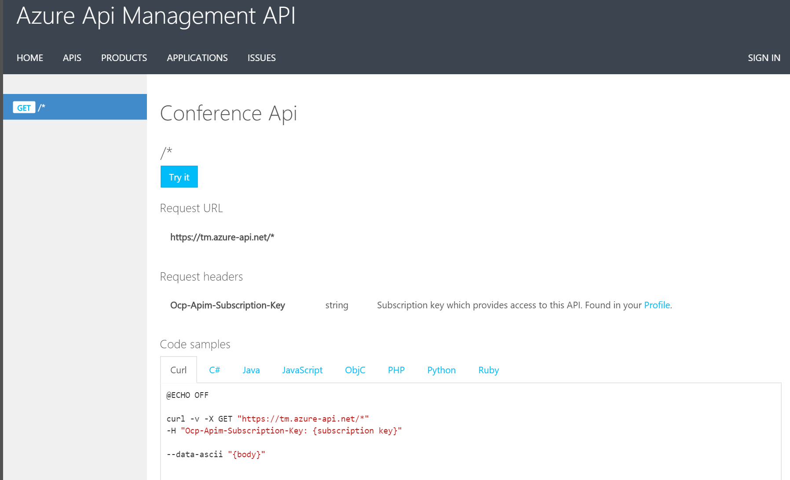
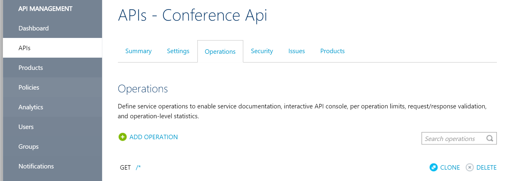
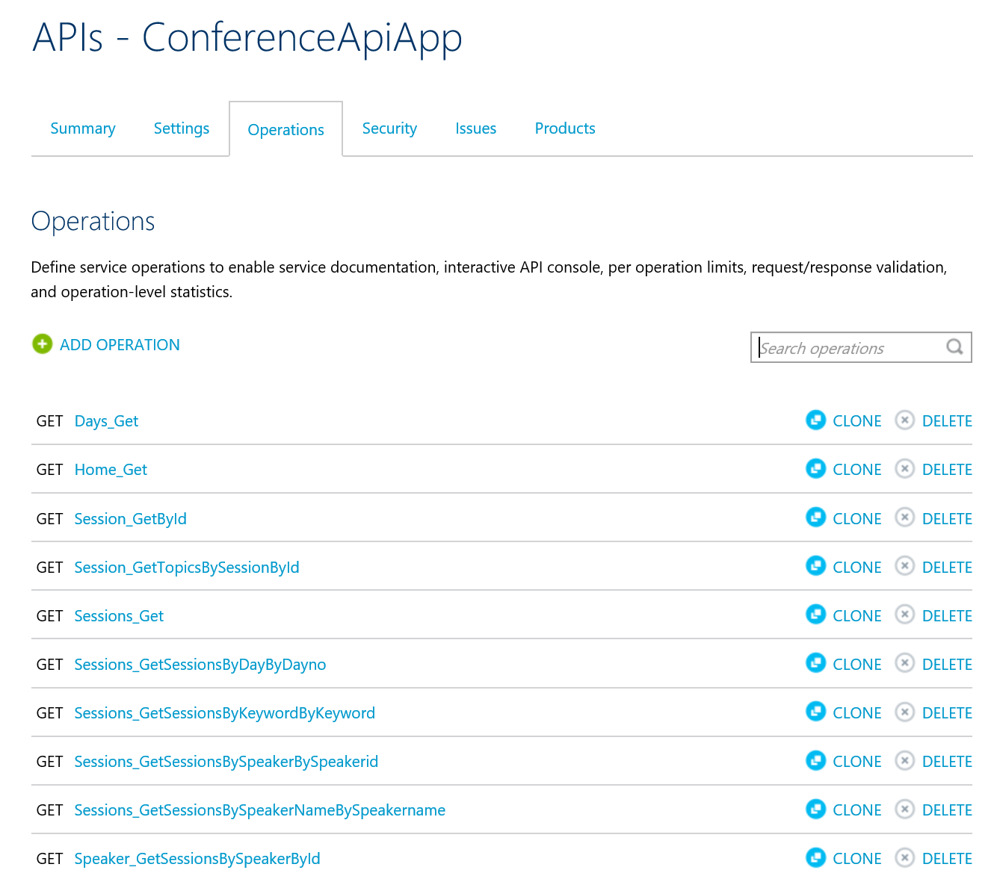
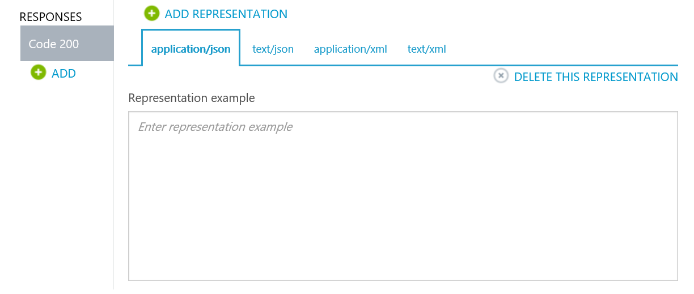
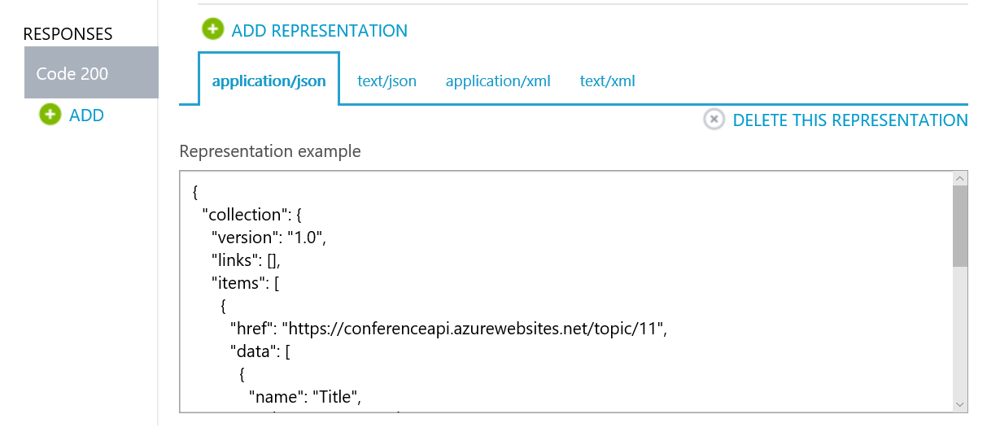

# Evolving the API Management Endpoint

We are going to focus now on improving the API Management experience for our developers and evolving our endpoint by adding features such as authentication.

## API Documentation

- From the developer's perspective, look at the **Conference Api** and specifically the single current operation.

  

- Houston, we have a problem. That’s not exactly useful documentation for the API.  You can do it all yourself, by creating custom Content pages.

  > **TRY:** Create a single custom content page and fill the page with information about your endpoint. This is completely up to you what you would like to put on the custom content page.

  

- It is not enough to create a content page, you need to hook it up to the menu. Once it is hooked up, you can view the content page from the developer perspective.

  > **TRY:** Add your custom content page to the top (main) navigation menu. View this page using the developer account you created.

  

  

- But we would rather not re-implement the docs pages. Out of the box, they come with the Try functionality which is very useful.

  > **TRY:** Go back to the API page describing your single current operation, try invoking that operation using the "Try" functionality on the page.

- We will navigate from the developer portal to the admin portal.

  

- We can add new operations manually. We will add an operation for the **http://conferenceapi.azurewebsites.net/Speakers** operation.

  > **TRY:** Add this operation to your own API. First test the operation using a GET request against your back-end API and then add it to your API Management front-end API.

  

  

- Let’s take a short detour over to policies,

  

- The defined operations are now showing up as a policy scope. The configured Rewrite rule is simply a policy.

  

- Back to the Speakers Operation configuration and let us define some known responses. These known responses are useful to developers using our API because they can know what to expect in a JSON response for their requests to the Operation.

  > **TRY:** Execute the Speakers API operation and view the response. Use this information to create a JSON representation of the response. An example is shown in the screenshot below.

  

- Returning to the developer portal, we can see the documentation for our Speakers operation.

  > **TRY:** View the new page for the Speakers operation. You should see useful information on the page including a representation of the JSON response.

  

## Importing API Specifications

- For a large API, creating all the operation descriptions could take a while. Another option is to import the operations based on an API Description language.

- .Net APIs can generate an API Description language document using a library called **Swashbuckle**. This library is an implementation of the Swagger standard for describing APIs using the JSON content format. You can import an entire API into API Management using a Swagger JSON file.

  > **TRY:** The Swagger documentation for our back-end API is located at http://conferenceapi.azurewebsites.net/swagger/docs/v1. Take a moment to view the document and then import it as a new API using the API Management portal. It is recommended to give the API a URL suffix so you can tell the difference between this API and the first API you created (Conference Api).

  

- Once you have imported your new API, review the imported operations.

  

- You can drill down into each operation and view the parameters

  

- Operations also include metadata about responses. Response types are defined based on formatters available.

  

    > **TRY:** View the parameters, responses and metadata for each operation you imported using both the API Management portal and the Developer portal. Add this API to the *Free & Wild* product and then make a few sample requests to make sure that you understand how the API works.

- Swashbuckle doesn’t support representation examples out of the box unfortunately. So they need to be added manually. Unfortunately, importing an existing API doesn’t merge.

  

- So, lets head back over to the developer portal to see what this import gives us.

  

- Getting ASP.Net Routing to sync with Swashbuckle and OpenAPI specification can be challenging. There is a risk that for a non-trivial API the effort to generate the right API description automatically and deal with merge issues, the less time saved over just manually defining the API.

- A compromise is to hand craft the OpenAPI specification and then import that.

  > **TRY:** Import the OpenAPI spec as another new APi in API Management. View the parameters, responses and metadata for each operation you imported using both the API Management portal and the Developer portal. Add this API to the *Free & Wild* product and then make a few sample requests to make sure that you understand how the API works.

  

## Styling

- You can customize the CSS values for many different properties in the Developer portal.

  > **TRY:** Click on the branding icon on the left of the Developer Portal (you must be signed in as an administrator). Update the branding to use a different set of colors and other values (font-sizes, heights, etc.).

  

## Security

- In order to protect the origin server from direct access we need to enable security on the origin server. Change the Web service URL to use https scheme as basic auth is enabled for https for this particular API.

  > **TRY:** Update the Conference Api (first Api you created) to reference the back-end api using *HTTPS* instead of *HTTP*.

  

- In the **Security** tab, you can configure authentication from API Management to the back-end API.

  > **TRY:** Setup the Basic Auth credentials to allow API Management to call the origin server. The username is *apim* and the password is *rocks*.

  

## Recap

In this exercise we:

  - Created a custom page for the developer portal
  - Updated our documentation to more accurately reflect our API
  - Imported Swagger documentation to import API endpoints and documentation in-mass.
  - Rebranded the developer portal using CSS values
  - Implemented authentication between our API tiers.

## (Bonus) User Authorization

> Setting up user authentication requires you to create a client application. This is beyond the scope of this bootcamp but it is easily something you can do on your own time. We have included screenshots to help you get started.

This is used to setup the Developer Console as a Client Application

Click on Manage Authorization Servers

And then Add Authorization Server and you are presented with the “Form From Hell”

Fortunately, it is much easier to actually secure your API. Go back to policies.

Place cursor in &lt;inbound&gt; element and select &lt;validate-jwt&gt;. Update as follows

The next step is to build a client that can authenticate using the OAuth provider. But that is an exercise to be left to the student!

All the API Management documentation, reference materials, samples, howtos, videos and screencasts can be found at <http://aka.ms/apimrocks>
